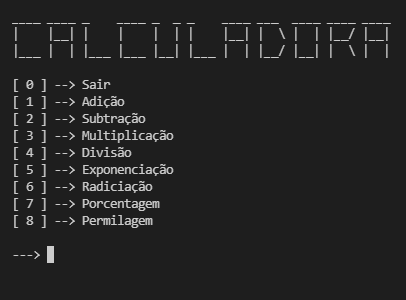

<h1>Calculadora</h1>

<h2>Uma calculadora feita em python</h2>

Dividida em dois arquivos: 

<ul>
    <li>Arquivo principal (calculadora.py)</li>
    <li>Arquivo com as funções que realizam os cálculos (calculos.py)</li>
</ul>

